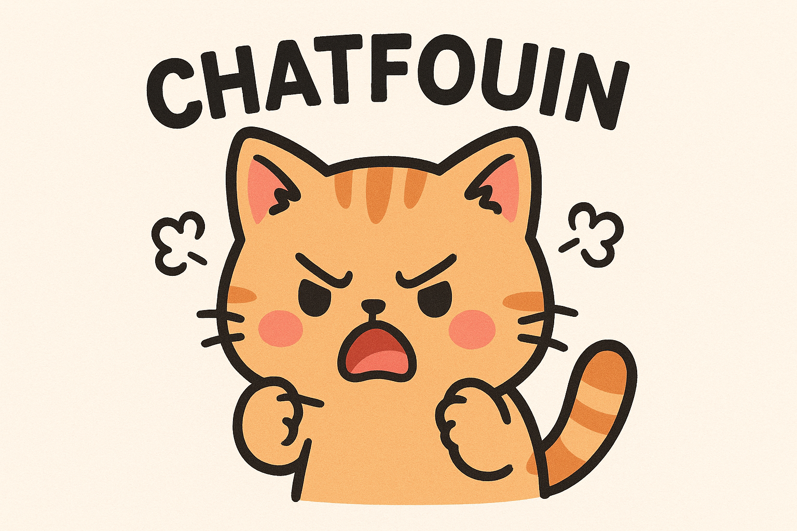

Chatfouin est un **détecteur de texte IA** qui permet d’identifier si un texte a été rédigé par un **humain** ou par une **intelligence artificielle**.  
Ce projet utilise le modèle **[`mistral-large-latest`](https://docs.mistral.ai/)** pour l’analyse et est développé avec **Next.js**, **React** et **TypeScript**.
Pour l'utiliser : [Chatfouin](https://chatfouin.vercel.app/)
---


## 🔍 **Détection IA/Humain** : Analyse un texte et estime s’il a été généré par une IA ou écrit par une personne réelle.  

---

## 🛠️ Stack Technique

- **Framework** : [Next.js](https://nextjs.org/)  
- **Langage** : [TypeScript](https://www.typescriptlang.org/)  
- **Frontend** : [React](https://react.dev/)  
- **Modèle LLM** : [Mistral Large](https://docs.mistral.ai/) (`mistral-large-latest`)  
- **API** : Appel au modèle via une API (par exemple Mistral API ou OpenAI compatible).  

---

## 📦 Installation

Clone le projet :  
```bash
git clone https://github.com/warrox/chatfouin.git
cd chatfouin
